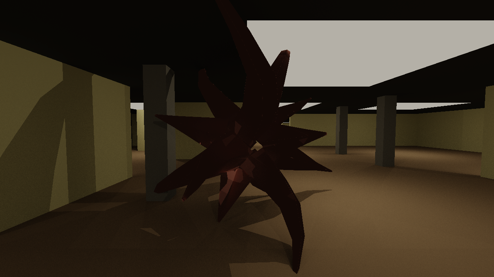

# Backrooms Sim

Infinite, never-repeating, procedurally generated **Backrooms walking
simulation**. Native Windows, C++20, D3D12 + DXR, with a local-LLM Director.
A demonstration/visualization — no win state, no combat, no asset files
(everything is procedural).

Built autonomously, milestone by milestone, with machine-checkable gates.
Canon: [`docs/ARCHITECTURE.md`](docs/ARCHITECTURE.md). Build sequence:
[`docs/MILESTONES.md`](docs/MILESTONES.md). Where the build stands:
[`docs/SESSION_LOG.md`](docs/SESSION_LOG.md).



> *The AI Shoggoth, path-traced. Everything in this frame is generated from a seed — the
> walls, the fluorescent lights, the creature, and the lighting that falls on it. Rendered
> with `backrooms --shoggoth-dxr-shot --seed 11 --pose 0`.*

## The Shoggoth — a living, AI-driven monster (Phase III)

An autonomous creature hunts the wanderer through the maze. Its whole sensory arc is built
milestone by milestone (M20–M25), and **determinism stays sacred** throughout — every AI
decision enters the sim only as a recorded event at a deterministic tick, so a recorded
chase **replays bit-identically with every model offline**:

- **Body + navigation** — a procedural warm-salmon radial-tentacle body (no assets) with
  deterministic BFS maze-pathfinding toward the wanderer, visible in **both** the raster and
  the **ray-traced** renderers.
- **A KEEL brain** — a local LLM (the same sovereign KEEL substrate as the Director) chooses
  what the creature *wants* (hunt / stalk / lurk / flank / flee). It runs **live, off the
  120 Hz frame thread**, so it thinks while you play without ever hitching.
- **Eyes** — a virtual camera renders the creature's POV; a local **vision model**
  (qwen-VL + an `mmproj` projector) looks at the frame and informs the intent.
- **Ears + a voice** — the creature hears its surroundings through **whisper.cpp**, and the
  Backrooms PA speaks through a **from-scratch procedural formant TTS** (no assets) that
  whisper reads back as words (*"Evacuate sector five."*).

```powershell
backrooms --shoggoth --out chase.png                     # headless: a deterministic chase + top-down map
backrooms --shoggoth-dxr-shot --pose 0 --out shot.png    # the creature in the path-traced path
backrooms --game --rt                                    # play it: the creature hunts you, ray-traced
```

## Prerequisites

- Windows 10/11 x64
- Visual Studio 2022 (Desktop development with C++) + Windows 11 SDK (DXR)
- CMake ≥ 3.28, Ninja (the VS-bundled copies are fine)
- Git (for vcpkg bootstrap). NVIDIA RTX GPU for the path-traced mode (M9+).

`scripts/build.ps1` bootstraps **vcpkg** automatically (to `C:\vcpkg` or
`$env:VCPKG_ROOT`) and imports the MSVC dev environment, so a fresh clone needs
no manual setup beyond the toolchain above.

## Build, test, gate

```powershell
powershell -NoProfile -ExecutionPolicy Bypass -File scripts/build.ps1            # incremental build
powershell -NoProfile -ExecutionPolicy Bypass -File scripts/build.ps1 -Clean     # clean build
ctest --test-dir build --output-on-failure                                       # run tests
powershell -NoProfile -ExecutionPolicy Bypass -File scripts/gate.ps1 -Milestone M0   # milestone gate
```

A milestone is done only when `gate.ps1 -Milestone M<N>` exits 0.

## Run

```powershell
powershell -NoProfile -ExecutionPolicy Bypass -File scripts/run.ps1          # build + a lit smoke render -> runs/run-smoke.png
powershell -NoProfile -ExecutionPolicy Bypass -File scripts/run.ps1 -Window  # build + launch the playable walk
```

### Play the game (`v2.0`)

```powershell
backrooms --game                                                          # the windowed game: menu -> walk
powershell -NoProfile -ExecutionPolicy Bypass -File scripts/package.ps1   # build the portable .zip -> dist/
```

`--game` boots to a main menu (New Game / Continue / Settings / Quit) and runs the
walk with WASD + mouse-look, **gamepad**, **F11 fullscreen**, and **persistent settings**.
`scripts/package.ps1` produces a self-contained **portable folder** (exe + the bundled DXC
DLLs + README/CREDITS) that runs on any Windows 10/11 machine with no SDK — unzip, run
`RUN.cmd`. See the **[User Guide](docs/USER_GUIDE.md)** to play and the
**[Design & Architecture](docs/DESIGN.md)** doc for how it all works.

Everything is procedural — no asset files; geometry, materials, audio, and lighting
are all generated from a seed at runtime. Highlights:

- **Path-traced mode (DXR):** `backrooms --dxr-pt --pose P --spp N --out shot.png`
- **The noclip intro:** `backrooms --intro` (mundane room → fall-through → Level 0)
- **8 h walk-bot soak:** `scripts/soak.ps1 -Hours 8`
- **Framed captures ("photo mode"):** `--shot` / `--dxr-pt` / `--topdown` write
  deterministic PNGs. Configuration is the CLI flag surface (see `app/MODULE.md`).

### The Director (optional local LLM)

The ambient **Director** routes to a local **KEEL** sidecar (OpenAI-compatible HTTP)
for inference — no model is bundled. Start the sidecar, then add `--director`:

```powershell
scripts/soak.ps1 -Hours 8 -Director     # acceptance soak with the Director ON
backrooms --director-probe              # one-shot: a WandererSummary -> a directive
```

The Director is **enhancement-only** (INV-6): `--no-director` (the default) runs the
full sim with no LLM. Determinism is preserved — the model's output enters the sim
only as a recorded event log, so a replay is **bit-identical with the model offline**.

## Layout

`core` `gen` `stream` `render_d3d12` `render_dxr` `audio` `telemetry`
`director` `app` `tools` — see each module's `MODULE.md`. Dependency arrows
point downward only; `core` depends on nothing.
